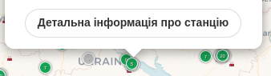

<!-- # Data visualizer from SaveEcoBot. Calculate AQI -->
# Візуалізатор вихідних даних з SaveEcoBot. Обчислює AQI

>**[Read in English :world_map:](README.md)**

<!-- This software up and run nice dashboard with metrics from CSV file and calculate AQI for PM2.5 and PM10 -->
Це програмне забезпечення підготує та запустить панель з усіма показниками з CSV-файлу а також обчислить і покаже AQI для PM2.5 та PM10.

<!-- Air Quality Index calculations based on [this document](https://www.airnow.gov/sites/default/files/2018-05/aqi-technical-assistance-document-may2016.pdf) -->
Розрахунки Індексу Якості Повітря (Air Quality Index) базуються на основі [цього документа](https://www.airnow.gov/sites/default/files/2018-05/aqi-technical-assistance-document-may2016.pdf).


<!-- More screenshots and usage examples [here](docs/en/screenshots.md). -->
Більше скріншотів та прикладів використання [наведено тут [en]](docs/en/screenshots.md).

---

## МЕНЮ <!-- omit in toc -->

* [Необхідне програмне забезпечення](#необхідне-програмне-забезпечення)
* [Використання](#використання)
  * [Швидкий старт](#швидкий-старт)
  * [Повсякденне використання](#повсякденне-використання)
    * [Запуск](#запуск)
    * [Зупинка](#зупинка)
  * [Датчики](#датчики)
    * [Оброблення нових даних](#оброблення-нових-даних)
    * [Додавання нових даних](#додавання-нових-даних)
    * [Видалення даних](#видалення-даних)
  * [Повне очищення](#повне-очищення)
* [Для контриб'юторів](#для-контрибюторів)
* [Плани на майбутнє](#плани-на-майбутнє)
* [Хочете допомоги?](#хочете-допомоги)
* [Ліцензія та авторські права](#ліцензія-та-авторські-права)

---

<!-- ## Required software -->
## Необхідне програмне забезпечення

* [`Docker`](https://docs.docker.com/get-docker/)
* [`docker-compose`](https://docs.docker.com/compose/install/) (для Linux)

<!-- ## Usage -->
## Використання

<!-- ### Quick start -->
### Швидкий старт

<!-- 1. Clone this repo or [download it as zip](https://github.com/MaxymVlasov/eco-data-visualizer/archive/master.zip) and unpack. -->
1. Зклонуйте цей репозиторій

```bash
git clone git@github.com:MaxymVlasov/eco-data-visualizer.git
```

або [завантажте його як zip архів](https://github.com/MaxymVlasov/eco-data-visualizer/archive/master.zip) і розпакуйте.

<!-- 2. Choose SaveEcoBot station [on this map](https://www.saveecobot.com/en/maps) and click 'Details'   -->
2. Виберіть станцію SaveEcoBot [на цій мапі](https://www.saveecobot.com/uk/maps) та натисніть "Детальна інформація про станцію"  


<!-- 3. On bottom you'll see `Download raw data (CSV)`   -->
<!-- click on the link and save CSV-file to `./data/original_data/` inside downloaded repo. -->
3. Унизу ви побачите "Завантажити дані у форматі CSV"  
  
натисніть на посилання і збережіть CSV-файл у `./data/original_data/` всередині завантаженого репозиторію.

<!-- 4. Open terminal in the root of `eco-data-visualizer` and run: -->
4. Відкрийте термінал у корені `eco-data-visualizer` і виконайте:

```bash
# Підготовка даних
docker build -t data-transformer ./data-transformer-app
docker run -v "$PWD"/data/:/app/data/ --rm data-transformer
# Запуск візуалізації
docker-compose up -d
# Додавання даних датчиків до InfluxDB
docker build -t add_influx_data ./provisioning/influx
docker run -v "$PWD"/data/influx/:/influx-data/ --rm --network=eco-data-visualizer_default add_influx_data
```

<!-- ><sup>Depending on your internet bandwidth, CPU, Storage I/O, CSV file size and number of processed files `First Init` may take different times.  
For example, in laptop with `100Mbit/s` bandwidth, `Intel Core i7-8550U` (max clock speed `4Ghz`), SSD disk and:</sup>  
<sup>  - 2 CSV files (together: 620MB) it takes `11m47s` (`9m39s` to transform data)</sup>  
<sup>  - 1 CSV file (513MB) - `6m16s` (`4m18s` to transform data)</sup>  
<sup>  - 1 CSV file (107MB) - `6m35s` (`4m32s` to transform data)</sup>
 -->
<!-- markdownlint-disable no-inline-html -->
><sup>Залежно від пропускної здатності вашого інтернет-каналу, параметрів процесора, жорсткого диску, розміру CSV-файлу та кількості оброблених файлів `Швидкий старт` може тривати різний час.  
Наприклад, у ноутбуці з пропускною здатністю `100 Мбіт/с`, `Intel Core i7-8550U` (максимальна тактова частота `4ГГц`), з SSD-диском та: </sup>  
<sup> - 2-ма файлами CSV (разом: 620MB) потрібно `11m47s` (з них `9m39s` для перетворення даних) </sup>  
<sup> - 1-ним файлом CSV (513MB) - `6m16s` (з них `4m18s` для перетворення даних) </sup>  
<sup> - 1-ним файлом CSV (107MB) - `6m35s` (з них `4m32s` для перетворення даних) </sup>
<!-- markdownlint-enable no-inline-html -->

<!-- 5. Open [http://localhost/](http://localhost/) for see visualizations! -->
5. Відкрийте [http://localhost/](http://localhost/), щоб побачити візуалізацію!

<!-- ### Daily usage -->
### Повсякденне використання

<!-- #### Start -->
#### Запуск

<!-- For start visualization open terminal in the root of repo and run: -->
Для запуску візуалізації відкрийте термінал у корені репозиторія і виконайте:

```bash
docker-compose up -d
```

<!-- Then open [http://localhost/](http://localhost/) for see visualizations. -->
Потім відкрийте [http://localhost/](http://localhost/), щоб побачити візуалізацію.

<!-- #### Stop -->
#### Зупинка

<!-- For stop visualization open terminal in the root of repo and run: -->
Для зупинки візуалізації відкрийте термінал у корені репозиторія і запустіть:

```bash
docker-compose stop
```

<!-- ### Sensors data -->
### Датчики

<!-- #### Process new data -->
#### Оброблення нових даних

<!-- 1. Download CSV file from SaveEcoBot station -->
<!-- 2. Move it to `data/original_data` folder in this repo. -->
1. Завантажте CSV-файл з SaveEcoBot
2. Перемістіть його в теку `data/original_data` цього репозиторія.
3. Виконайте:

```bash
# Видалення тимчасових файлів
docker run -v "$PWD"/data/:/app/ --rm amancevice/pandas:1.0.3-alpine sh -c "rm -f /app/csv/*.csv /app/influx/*.influx"
# Підготовка даних
docker build -t data-transformer ./data-transformer-app
docker run -v "$PWD"/data/:/app/data/ --rm data-transformer
```

<!-- #### Add new data -->
#### Додавання нових даних

<!-- For add new data open terminal in the root of repo and run: -->
Для додавання нових даних у візуалізацію відкрийте термінал у корені репозиторія і виконайте:

```bash
# Запуск візуалізації
docker-compose up -d
# Додання нових даних
docker build -t add_influx_data ./provisioning/influx
docker run -v "$PWD"/data/influx/:/influx-data/ --rm --network=eco-data-visualizer_default add_influx_data
```

<!-- #### Remove data -->
#### Видалення даних

<!-- For remove sensors data open terminal in the root of repo and run: -->
Для видалення даних датчиків з візуалізації відкрийте термінал у корені репозиторія і виконайте:


```bash
docker-compose down
docker volume rm eco-data-visualizer_sensors-data
```

<!-- ### Cleanup -->
### Повне очищення

<!-- For cleanup open terminal in the root of repo and run: -->
Для повного очищення відкрийте термінал у корені репозиторія і запустіть:

```bash
# Зупинка візуалізації
docker-compose down
# Видалення томів з налаштуваннями та даними датчиків
docker volume rm eco-data-visualizer_grafana-settings eco-data-visualizer_sensors-data
# Видалення тимчасових файлів
docker run -v "$PWD"/data/:/app/ --rm amancevice/pandas:1.0.3-alpine sh -c "rm -f /app/csv/*.csv /app/influx/*.influx"
```

<!-- ## For contributors -->
## Для контриб'юторів

<!-- Use same instructions from [Quick start](#quick-start) section but in step 4 add `--build-arg ENV=dev` for `data-transformer-app` -->
Скористайтеся тими ж інструкціями з розділу [Швидкий старт](#швидкий-старт), але на кроці 4 додайте `--build-arg ENV=dev` для `data-transformer-app`.

```bash
docker build --build-arg ENV=dev -t data-transformer ./data-transformer-app
```

<!-- ## Future plans -->
## Плани на майбутнє

Дивіться [відповідну секцію](README.md#future-plans) в англомовній версії.

<!-- markdownlint-disable no-trailing-punctuation -->
<!-- ## Want help? -->
## Хочете допомоги?
<!-- markdownlint-enable no-trailing-punctuation -->

<!-- You can:
* Improve this software (see [Future plans](#future-plans-) section)
* [Donate to SaveEcoBot](https://www.saveecobot.com/en/donate)
* Assemble or buy Air quality monitoring station and connect it to SaveEcoBot. SaveDnipro can assemble and connect it for you. [Buy here](https://www.savednipro.org/product/stanciya-monitoringu-yakosti-povitrya/) -->

Ви можете:

* Удосконалити це програмне забезпечення (див. розділ [Плани на майбутнє [en]](README.md#future-plans)).
* [Зробити пожертву у SaveEcoBot](https://www.saveecobot.com/uk/donate).
* Зібрати або придбати станцію контролю якості повітря та додати її до SaveEcoBot. SaveDnipro може зібрати і додати його для вас. [Замовляти тут](https://www.savednipro.org/product/stanciya-monitoringu-yakosti-povitrya/).

<!-- ## License and Copyrights -->
## Ліцензія та авторські права

<!-- This software licensed by [Apache License 2.0](LICENSE) -->
Це програмне забезпечення розповсюджується під ліцензією [Apache License 2.0](LICENSE).

<!-- All data from SaveEcoBot licensed by [Creative Commons Attribution License 4.0 International](https://creativecommons.org/licenses/by/4.0/legalcode) -->
Усі дані з SaveEcoBot розповсюджуються під ліцензією [Creative Commons Attribution License 4.0 International](https://creativecommons.org/licenses/by/4.0/legalcode).

<!-- Other data and sources can be licensed in different way. -->
Інші дані та джерела можуть мати інші ліцензії.
