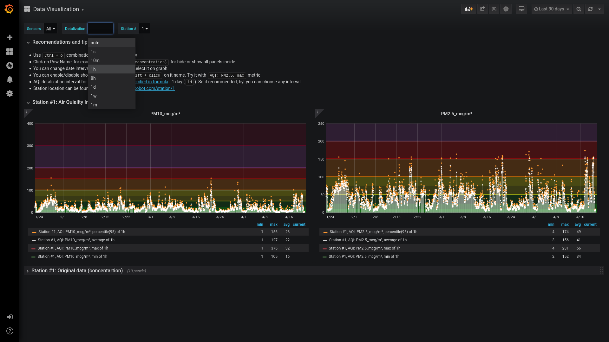
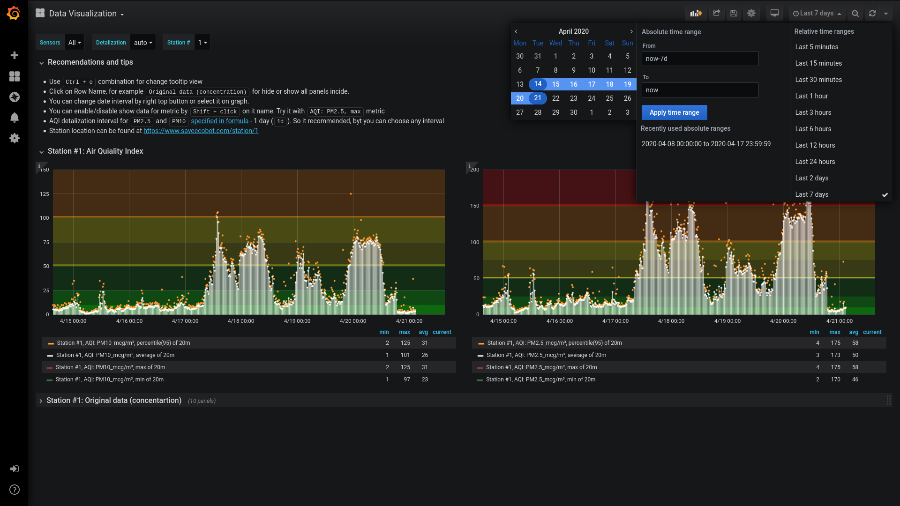
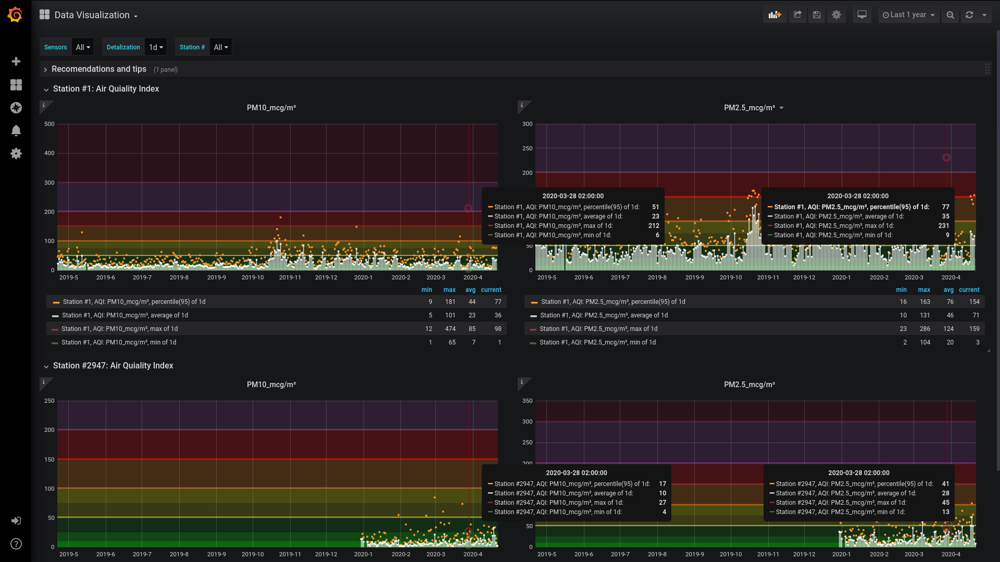
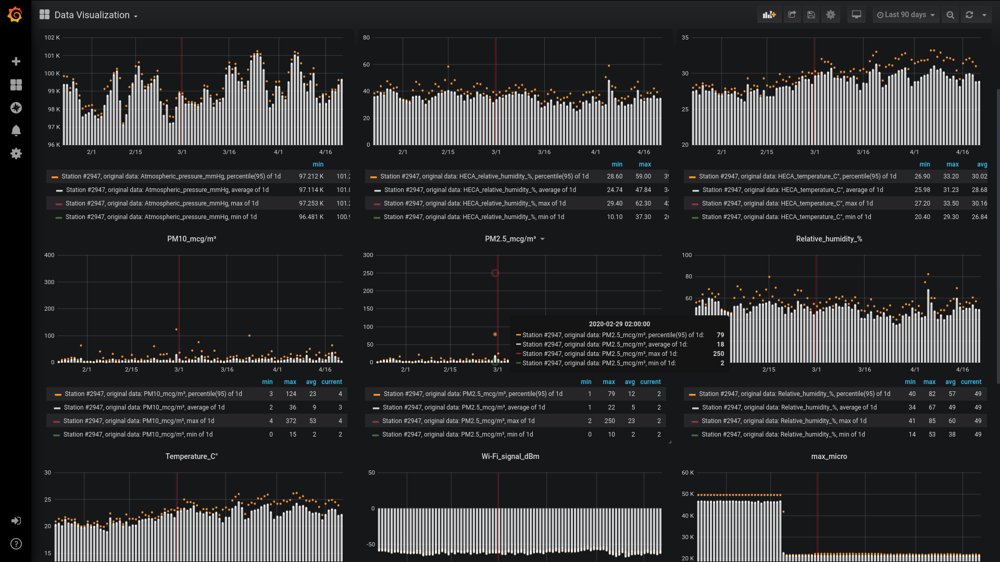
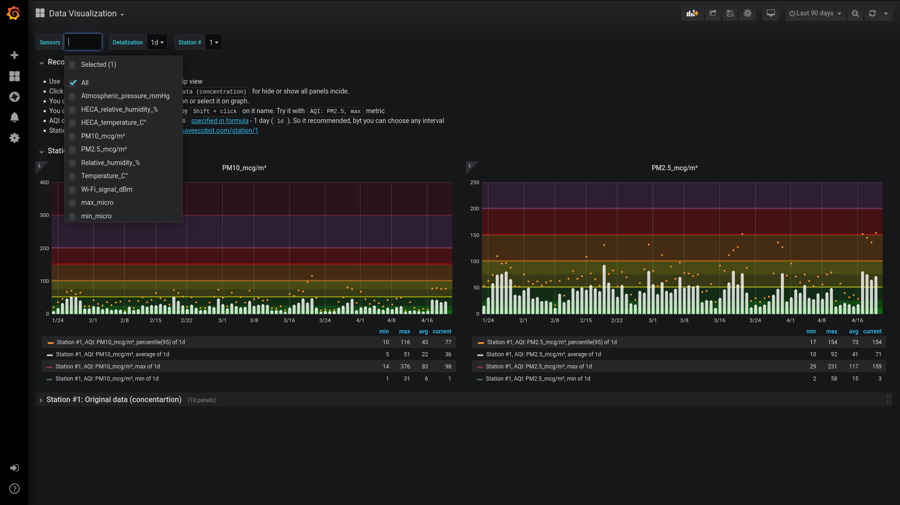

# Screenshots and Usage examples

**You can:**

* [Change step for data aggregation (detalization)](#change-step-for-data-aggregation-detalization-)
* [Choose time interval](#choose-time-interval-)
* [Compare data from many stations](#compare-data-from-many-stations-)
* [Show sensors original data](#show-sensors-original-data-)
* [Select sensors that should be shown in `Original data` row](#select-sensors-that-should-be-shown-in-original-data-row-)

Back to [README.md](../../README.md)

##### Change step for data aggregation (detalization) [`↑`](#screenshots-and-usage-examples)

##### Choose time interval [`↑`](#screenshots-and-usage-examples)

Also have Zoom IN and Zoom OUT functional. And you can select interval in graph.

##### Compare data from many stations [`↑`](#screenshots-and-usage-examples)

##### Show sensors original data [`↑`](#screenshots-and-usage-examples)

##### Select sensors that should be shown in `Original data` row [`↑`](#screenshots-and-usage-examples)

Back to [README.md](../../README.md)
